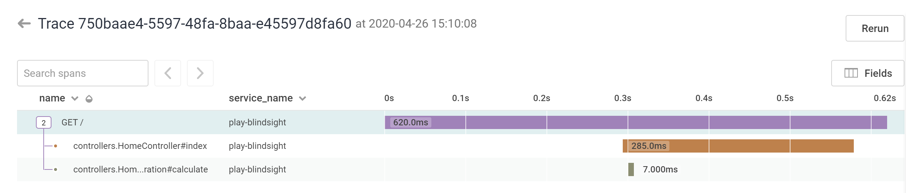

# Play-Blindsight

This is an example Play project that shows how to integrate [Play](https://www.playframework.com/) with [Honeycomb Tracing](https://docs.honeycomb.io/working-with-your-data/tracing/explore-trace-data/) using the [flow logger](https://tersesystems.github.io/blindsight/usage/flow.html) from [Blindsight](https://tersesystems.github.io/blindsight/).

## Requirements

You will need a Honeycomb account, which is free:

https://ui.honeycomb.io/signup

Create a dataset called `blindsight-test`.

Once you have the account, you'll need to set the environment variables.

```bash
export HONEYCOMB_API_KEY=<your-write-key>
export HONEYCOMB_DATASET=blindsight-test
```
 
These correspond to the honeycomb appender in `conf/logback.xml`

```xml
  <appender name="HONEYCOMB" class="com.tersesystems.logback.honeycomb.HoneycombAppender">
    <apiKey>${HONEYCOMB_API_KEY}</apiKey>
    <dataSet>${HONEYCOMB_DATASET}</dataSet>
    <!-- ... -->
  </appender>
```

## Running

Assuming you have sbt and java installed:

```scala
sbt run
```

And go to http://localhost:9000.

You will see the page render.

Now go to the `blindsight-test` dataset in Honeycomb, and click on the trace that you see down at the bottom.  You should see:



## How It Works

[Magic](https://tersesystems.github.io/blindsight/usage/flow.html#integrating-with-tracing).